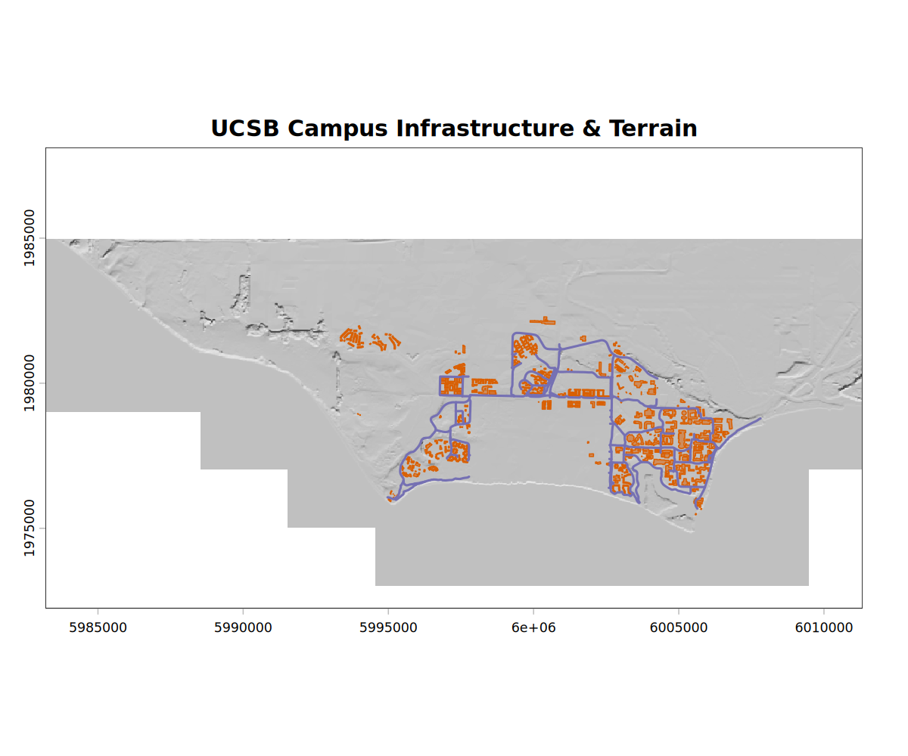

1. Explore the scenario
  a. I know about native cultural burns and the paleofire records. And I know about 20th century fire suppression regimes leading to current megafires. But the large burns recorded on this set of Annual Report maps have been a mystery to me for a long time. (legend image)
  b. After I found scans and georeferenced them, the next step was to find shapefiles of fire perimeters -- which the coding assistant couldn't do. (it got stuck in a download loop between 2 open data sources that weren't robot readable.)
2. Show the outputs
2. I had a little side quest attempting to get the AI to trace the polygons on the map. (06_detect_burnt) That is sort of a holy grail.
3. Is it reproducible? 
  a. You could try to live-code with a new map [the Olympics?] a reproduction
  a. On my first try, I added 3 additional scanned maps:
  a. I started with the prompt:  `time for script #5. I have added scanned maps for Placerville, Big Trees, and Port
Orford California. There is a dataset on the web called FRAP that shows California
wildfires back to the 1800s. Get that dataset and make me 3 separate 50% sized png
representations of the 3 new maps. each one should be the scanned map with the
relevent portion of the FRAP dataset overlaid on top.`
  a. after a few iterations, I started having the AI print the prompt that generated the output on each jpeg
  a. This project structure was easy to port over to another folder of data. I started a fresh session in a directory with a slightly edited agents.md and was quickly able to see what was in the folder:

  [UCSB images]

*Figure: UCSB Infrastructure Map. This image was created by loading geospatial infrastructure data and mapping it using the `terra` package in R, demonstrating the project's ability to handle diverse geospatial datasets beyond forest maps.*

  