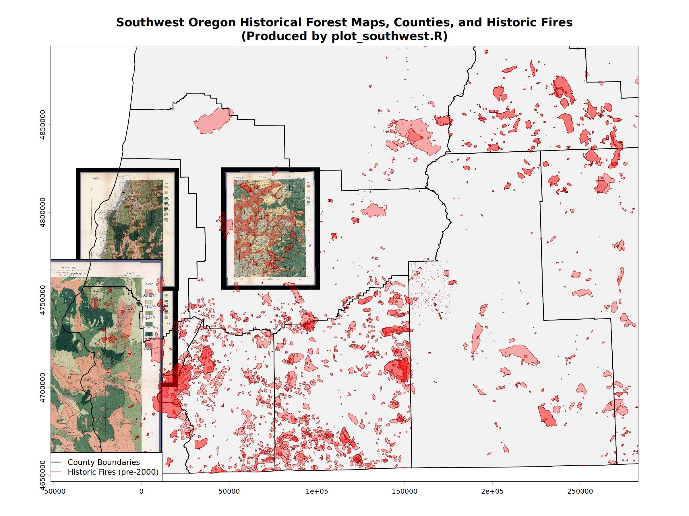
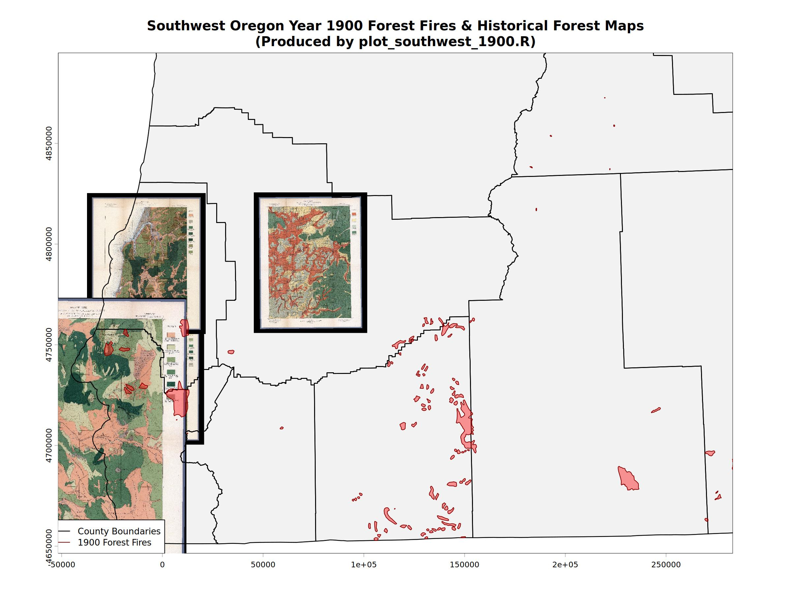
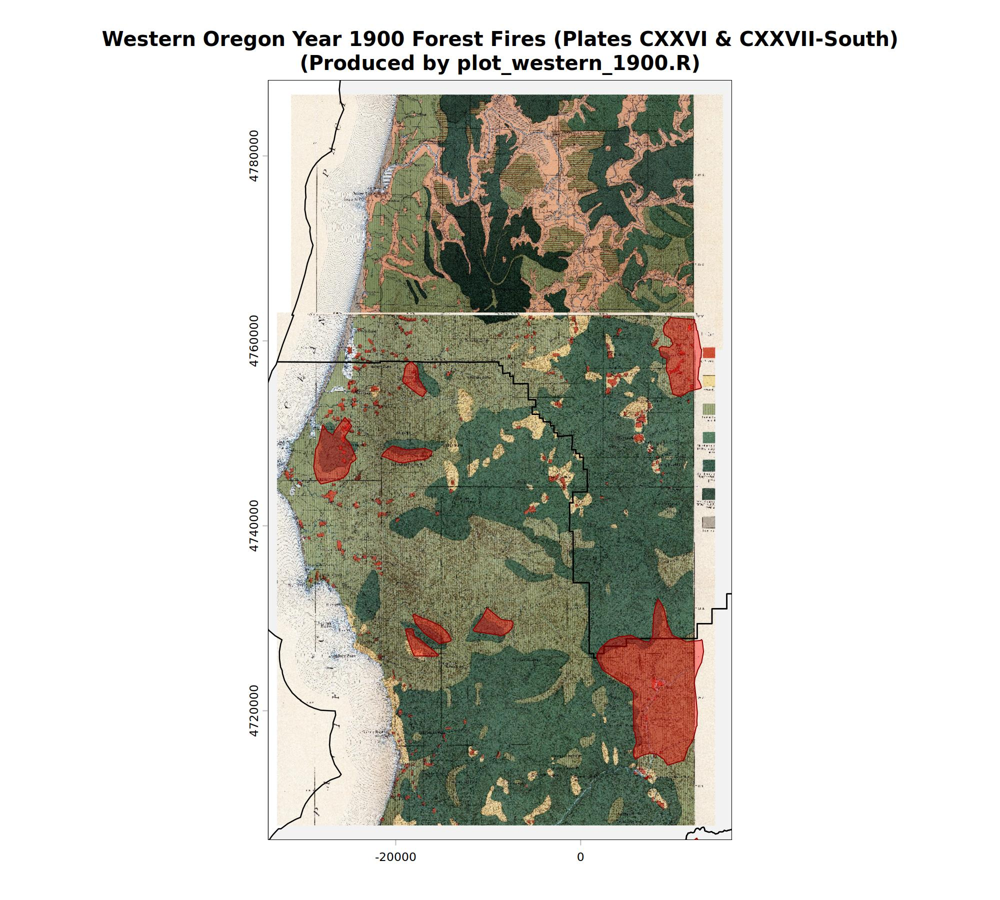
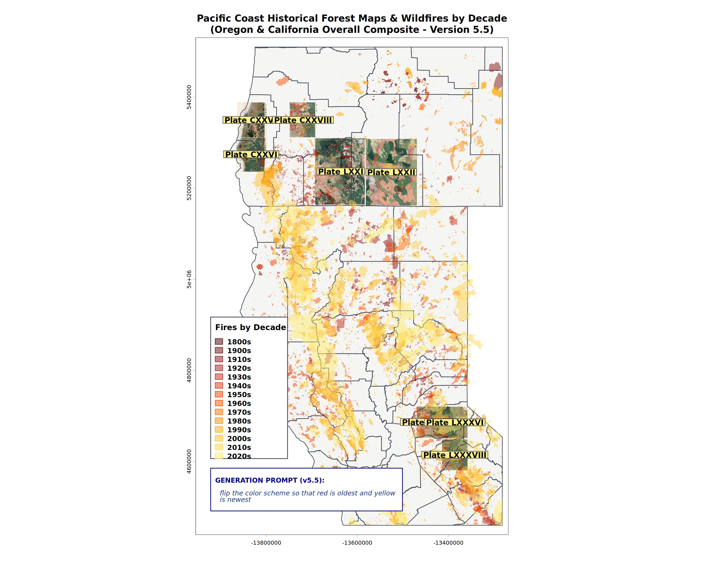

# Historical Geospatial Forest Fire Visualization: A Narrative & Didactic Guide

This document chronicles our investigative journey and technical workflows, explaining how we progressed from historical georeferenced scanned map rasters to fully integrated geospatial vector overlays of historic forest fires across Oregon and California.

---

## 1. Project Background & Scenario Discovery
- **The Core Historical Mystery**:
  - We began with a set of USGS and Annual Report forest classification maps from the late 19th and early 20th centuries. These maps depict historic land cover, standing timber volume, and notably, massive "burnt" areas.
  - While modern research heavily documents paleofire records, native cultural burns, and the 20th-century fire suppression regimes that paved the way for modern megafires, the exact perimeters and timing of the large burns shown on these historical maps remained a mystery.
  - To investigate this, we needed to compare the "burnt" zones marked on the historical scanned maps directly with historical wildfire databases.
- **The Georeferencing Stage**:
  - Raw scans of maps like the Big Trees Quadrangle, Placerville Quadrangle, and Port Orford Map were found and georeferenced.
  - This process assigned spatial coordinate systems (such as local Polyconic or Albers projections) to the raw image pixels, producing georeferenced raster files (`.tif` and world files) stored under `data/forest_maps/`.
- **The Vector Search Challenge**:
  - The next crucial step was to find vector shapefiles of historical fire perimeters.
  - Initially, automated assistants struggled to download these databases. They got stuck in robot-unfriendly redirect and download loops between several public open-data platforms.
  - Ultimately, we successfully acquired and structured two high-signal vector datasets:
    - **Oregon Historic Fires**: Found in `data/Historic_OR_Fires/` (covering pre-2000 fires).
    - **California FRAP Fire Perimeters**: Found in `data/California_Historic_Fire_Perimeters_FRAP/` (containing California wildfire histories dating back to the late 1800s).

---

## 2. Interactive Pipeline & The Role of R Scripts
To handle the geospatial projection, coordinate transformation, cropping, and rendering, we developed a sequence of R scripts. Below is the step-by-step breakdown of how these scripts run and interact:

- **[run_all.R](run_all.R)**:
  - *Purpose*: The master driver script.
  - *Workflow*: It sequentially loads and runs each of the specialized scripts below, handling any individual file errors gracefully to ensure consistent reproduction of the entire pipeline.
- **[01_plot_all.R](01_plot_all.R)**:
  - *Purpose*: Individual map verification and context mapping.
  - *Workflow*:
    - Iterates through each georeferenced raster found in the workspace.
    - Projects global vector layers (US Counties, Oregon Fires, and California FRAP Fires) into the exact native Coordinate Reference System (CRS) of each individual raster.
    - Applies custom southwest-expanded padding to provide geographical context, plotting the raster cleanly on top of county boundaries with a dedicated prompt tracing box in the lower-left corner.
  - *Outputs*:
    - Individual maps such as `output/01_map_Plate_CXXVI_v1.1.jpg` and `output/01_map_Plate_LXXII_v1.1.jpg`.
- **[02_plot_southwest.R](02_plot_southwest.R)**:
  - *Purpose*: Regional composite overview.
  - *Workflow*:
    - Computes the bounding box of Southwest Oregon in the rasters' native CRS.
    - Overlays all georeferenced Oregon raster sheets onto a single canvas.
    - Adds county boundaries and all pre-2000 historic fire vectors on top as a unified layer.
  - *Outputs*:
    - `output/02_oregon_southwest_composite_map.jpg`
- **[03_plot_southwest_1900.R](03_plot_southwest_1900.R)**:
  - *Purpose*: Narrowing the historical lens to a specific year.
  - *Workflow*:
    - Replicates the Southwest Oregon composite viewport from Script 02, but filters the historical fire shapefile to display only fires recorded in the key year **1900**.
  - *Outputs*:
    - `output/03_oregon_southwest_1900_map.jpg`
- **[04_plot_western_1900.R](04_plot_western_1900.R)**:
  - *Purpose*: High-performance multi-sheet seamless stitching.
  - *Workflow*:
    - Focuses on the westernmost sheets (Plates CXXVI & CXXVII).
    - Digitally "trims" the legend collars (cropping 200 pixels + 10% boundary on each edge) to remove overlapping text margins.
    - Generates both a standard-resolution composite and an ultra-high-resolution (8000x7200px) stitched map.
  - *Outputs*:
    - Standard resolution: `output/04_oregon_western_1900_map.jpg`
    - High-resolution: `output/04_oregon_western_1900_map_highres.jpg`
- **[05_california_composite.R](05_california_composite.R)**:
  - *Purpose*: Multi-state decadal synthesis.
  - *Workflow*:
    - Projects all Oregon and California raster sheets into Web Mercator (EPSG:3857).
    - Groups the massive combined fire perimeters into decadal categories (1800s through 2020s).
    - Renders them using a beautiful custom color ramp where red represents the oldest fires and yellow represent the newest, showing how fire patterns have evolved.
    - Displays a dynamic prompt version panel (currently `v5.5`) in the lower left alongside the legend.
  - *Outputs*:
    - `output/05_california_composite_map_v5.5.jpg`
- **[06_detect_burnt.R](06_detect_burnt.R)**:
  - *Purpose*: The "Holy Grail" of feature extraction. Haven't gotten this to work yet
  - *Workflow*:
    - Evaluates `data/burned.jpg` as a training template to extract the specific color signatures (using k-means clustering) used by historical cartographers to denote burnt regions.
    - Analyzes the scanned maps, calculates Red-to-Green density ratios, and extracts the historical hand-drawn burn polygons.
    - Converts identified cells into vector polygons and saves them as GeoJSON.
  - *Outputs*:
    - Raster mask: `output/06_burnt_Plate_CXXVI.tif`
    - Vector polygons: `output/06_burnt_Plate_CXXVI.geojson`
    - Diagnostic plot: `output/06_burnt_plot_CXXVI.jpg`
- **[07_frap_overlay.R](07_frap_overlay.R)**:
  - *Purpose*: California-specific wildfire overlay validation.
  - *Workflow*:
    - Directly overlays the high-resolution California FRAP database onto the Placerville, Big Trees, and Port Orford historical maps in their native coordinates.
  - *Outputs*:
    - `output/07_frap_overlay_Placerville.jpg`
    - `output/07_frap_overlay_BigTrees.jpg`
    - `output/07_frap_overlay_PortOrford.jpg`

---

## 3. Visual Gallery of Generated Maps
Below is a selection of the visual outputs generated by our R geospatial pipeline, demonstrating the progression from raw scans to vector overlays.

### A. Regional Composite & Overlays
- **Southwest Oregon Composite Map**
  - Displays georeferenced raster sheets seamlessly aligned with county borders and historic pre-2000 fire shapefiles.
  - 

- **Southwest Oregon Year 1900 Fires**
  - Isolates the fire polygons specifically recorded in the year 1900 to match the approximate era of the survey maps.
  - 

- **Western Oregon 1900 Fire Overlays**
  - Features collar-trimmed, stitched sheets (Plates CXXVI & CXXVII) plotted alongside 1900 fire perimeters.
  - 

### B. California FRAP Wildfire Overlays
- **Placerville Quadrangle**
  - Shows the georeferenced Placerville scan with actual historic FRAP fire perimeters overlaid in transparent red.
  - 

- **Big Trees Quadrangle**
  - Overlay of historic FRAP fire perimeters on the Big Trees Quadrangle.
  - 

- **Port Orford Quadrangle**
  - Overlay of historic FRAP fire perimeters on the Port Orford map.
  - 

### C. Multi-State Decadal Composite
- **Oregon & California Decadal Composite (Version 5.5)**
  - Synthesizes all available maps in Web Mercator projection. Fire perimeters are styled dynamically by decade using an inverted heat ramp (red representing older fires, yellow representing newer fires).
  - 

### D. Automated Feature Extraction
- **Burnt Area Detection Plot**
  - Highlights our k-means template-matching detection process, outlining classified burn zones with a cyan border.
  - 
  - Some day. Most work is being done with remote sensing imagery. Scanned maps, not so much.

### E. Infrastructure & Contextual Mapping
- **UCSB Infrastructure Map**
  - Demonstrates the flexibility of our vector mapping setup when applied to alternative, non-forest spatial data layers.
  - 
