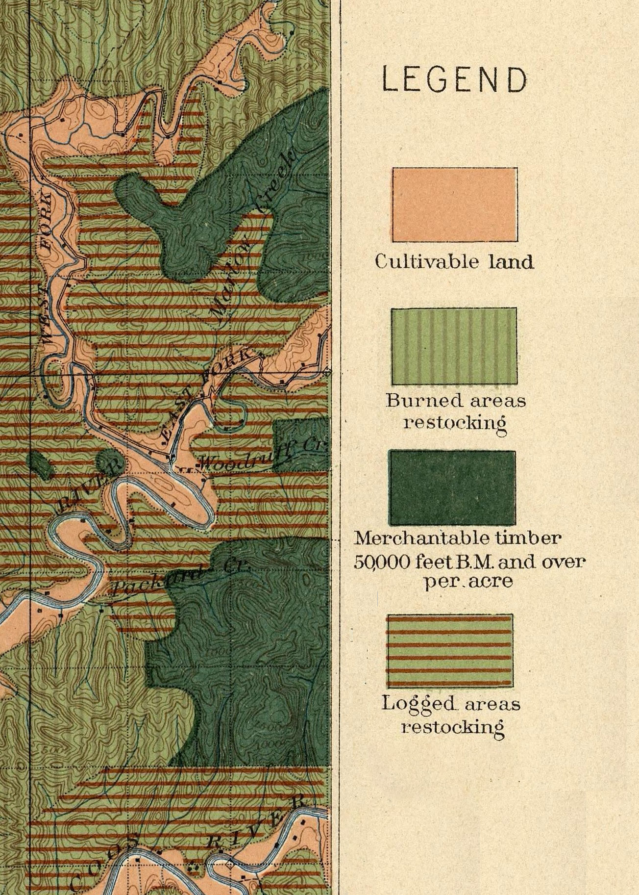

## About this project
This repo was created in conjunction with an [AI Agentic Coding workshop](https://carpentry.library.ucsb.edu/ai-coding-workshop/) at the 
UCSB Library

- This repo demonstrates a geospatial exploratory visualization of pre-1900 wildfire data in the US Pacific Northwest
- It uses R and Terra
- The scripts were created using various LLMs underneath OpenCode, including CIT's Gemma 4 and the DREAM Lab's granted GCP.
- The models used by OpenCode possess machine vision capabilities, allowing them, to some extent, to verify the results saved to the `output/` directory.
- Viewing the maps against the data allowed me to conclude that any fire marked 1900 meant that it was BEFORE 1900.
  - That is a detail that was NOT stated in the metadata. 

## Things I learned

1. Between sessions, telling the agent to run all the scripts to learn about the repo is essential
1. When moving to a new Coder workspace, the AI will iterate over R scripts to get libraries set up. It will do it largely unsupervised
2. During one iteration, I had it looking for its own datafiles on the web. As a skilled librarian, I was able to web search, identify and download California and Oregon fire perimeter files faster than the AI. I was able to see it get stuck fetching California fire perimeters from 2 different Arcgis Online addresses (both Living Atlas and cnra.ca.gov). It was nice to be able to pause the agent and then point it directly at the files I fetched and uploaded to my Coder workspace.

## Didactic
[Here is an outline of how I got to the 9 R scripts](didactic.html)

[Here is what Gemini has to say about how this was made](prompt_history_analysis.html)
I prompted this file because I was curious about how well Gemini could interpret its own code in new sessions. 
